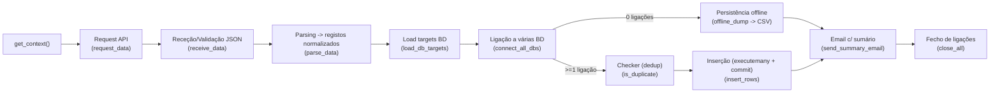

# Estágio — Pipeline Meteorologia (v0.3)

Este repositório documenta a evolução de uma **pipeline de recolha de dados meteorológicos via REST API** e **persistência em base(s) de dados**, com foco em **rastreabilidade**, **portabilidade** e **redundância**.

A versão **v0.3** representa o primeiro salto “grande” para uma execução mais realista:
- **Context-aware** via variáveis de ambiente (e compatibilidade com versões anteriores).
- **Vários destinos de BD** (fail-safe / redundância) via `db_targets.json`.
- **Deduplicação** (idempotência básica) por `fonte + data + lugar`.
- **Modo offline** automático (CSV) quando não há ligação a nenhuma BD.
- **Resumo por email** com tabela HTML e links úteis (ex. dashboard).

---

## Índice

- [O que mudou em v0.3](#o-que-mudou-em-v03)
- [Fluxo da pipeline](#fluxo-da-pipeline)
- [Requisitos](#requisitos)
- [Instalação](#instalação)
- [Configuração](#configuração)
  - [Variáveis de ambiente](#variáveis-de-ambiente)
  - [Ficheiro `db_targets.json`](#ficheiro-db_targetsjson)
- [Como executar](#como-executar)
- [Outputs](#outputs)
  - [Inserção em BD](#inserção-em-bd)
  - [Modo offline](#modo-offline)
  - [Email de resumo](#email-de-resumo)
- [Deduplicação](#deduplicação)
- [Schema mínimo recomendado](#schema-mínimo-recomendado)
- [Mapeamento de dados](#mapeamento-de-dados)
- [Snapshots e evidências](#snapshots-e-evidências)
- [Próximos passos](#próximos-passos)

---

## O que mudou em v0.3

### ✅ Alterações principais (comparado com versões anteriores)
- **API**: o endpoint passou a ser controlado por `PIPELINE_API_URL` (mantendo compatibilidade com `PIPELINE_API_URL_IPMA`).
- **Destinos de BD**: suporte a **múltiplas bases de dados** com lista de targets (`db_targets.json`), em vez de 1 config “hardcoded”.
- **Fail-safe**:
  - Se **nenhuma BD** estiver disponível → grava **CSV** em `offline_output/`.
  - Se algumas BD falharem → continua com as restantes, e reporta erros no email.
- **Idempotência básica**: verificação `SELECT 1 ... LIMIT 1` antes de inserir (evita duplicação em re-runs).
- **Email**: inclui contexto (pipeline/env/utilizador), lista de DBs ligadas / com erro, e opcionalmente `PIPELINE_DASHBOARD_URL_METEO`.

---

## Fluxo da pipeline



---

## Requisitos

- Python **3.10+** (recomendado)
- Dependências principais (v0.3):
  - `requests`
  - `psycopg2-binary` (ou `psycopg2`)
  - `python-dotenv`
  - `pandas`
  - `tabulate` *(se ainda estiveres a usar em versões anteriores / ferramentas auxiliares)*
  - `clts-pcp` *(opcional — para métricas mais ricas; a v0.3 já tem `StepMonitor` tolerante)*
- Acesso a 1 ou mais bases de dados PostgreSQL/compatível **(opcional)**
- SMTP acessível em `localhost` **(para envio de email)**

---

## Instalação

### 1) Criar ambiente virtual
```bash
python -m venv .venv
```

**Windows (PowerShell):**
```bash
.\.venv\Scripts\Activate.ps1
```

**Linux/macOS:**
```bash
source .venv/bin/activate
```

### 2) Instalar dependências
Se tiveres `requirements.txt`:
```bash
pip install -r requirements.txt
```

Se não tiveres:
```bash
pip install requests psycopg2-binary python-dotenv pandas clts-pcp tabulate
```

---

## Configuração

### Variáveis de ambiente

A pipeline lê variáveis via `.env` (com `python-dotenv`) e/ou variáveis do sistema.

Cria um ficheiro `.env` na raiz do projeto (ao lado do `main.py`), por exemplo:

```env
# contexto
PIPELINE_USER=gustavo
PIPELINE_ENV=local
PIPELINE_NAME=PCP-Meteo-v0.3

# API (novo) - mantém compatibilidade com PIPELINE_API_URL_IPMA (antigo)
PIPELINE_API_URL=

# email
PIPELINE_EMAIL_FROM=
PIPELINE_EMAIL_TO=
PIPELINE_DASHBOARD_URL_METEO=

# targets BD
PIPELINE_DB_TARGETS_FILE=db_targets.json
```

> **Recomendação:** não comitar `.env` (adiciona ao `.gitignore`) e criar um `.env.example` com placeholders.

---

### Ficheiro `db_targets.json`

A v0.3 suporta targets no formato:
- uma lista `[...]`, ou
- um objeto `{ "targets": [...] }`

Exemplo recomendado (**não comitar com passwords**; cria um `db_targets.example.json` e ignora `db_targets.json`):

```json
{
  "targets": [
    {
      "name": "aiven",
      "host": "HOST_AQUI",
      "port": 5432,
      "dbname": "DB_AQUI",
      "user": "USER_AQUI",
      "password": "PASSWORD_AQUI",
      "sslmode": "require"
    },
    {
      "name": "tidbcloud",
      "host": "HOST_AQUI",
      "port": 4000,
      "dbname": "DB_AQUI",
      "user": "USER_AQUI",
      "password": "PASSWORD_AQUI",
      "sslmode": "require"
    }
  ]
}
```

**Notas importantes:**
- Se `host` estiver vazio ou começar por `"Nao"` → o target é tratado como **offline/no-host**.
- Se o ficheiro não existir, há fallback para **1 target** via env (`DB_HOST`, `DB_PORT`, `DB_NAME`, `DB_USER`, `DB_PASSWORD`, `DB_SSLMODE`).

---

## Como executar

Na raiz do projeto:

```bash
python main.py
```

O script:
1. lê contexto,
2. chama a API,
3. normaliza os dados,
4. tenta ligar a todas as BD (targets),
5. insere com deduplicação (ou guarda CSV offline),
6. envia email de resumo,
7. fecha ligações.

---

## Outputs

### Inserção em BD

A inserção usa um `INSERT` para a tabela `meteo` com o subset mínimo:

- `fonte`
- `data`
- `temp`
- `humidade`
- `vento`
- `pressao`
- `precipitacao`
- `lugar`
- `lat`
- `lon`
- `regdata = NOW()`

### Modo offline

Se **nenhuma BD** estiver acessível, é gerado um CSV em:

- `offline_output/meteo_YYYYMMDD_HHMMSS.csv`

### Email de resumo

O email é enviado via `SMTP("localhost")` e inclui:
- identificação da pipeline (`PIPELINE_NAME`) e ambiente (`PIPELINE_ENV`),
- opcionalmente link de dashboard (`PIPELINE_DASHBOARD_URL_METEO`),
- tabela HTML com os passos e resultados (`StepMonitor.html_table()`),
- linhas extra (ex. lista de DBs ligadas e DBs com erro/offline).

> Em cloud, `localhost` pode não ter SMTP — aí tens de ajustar para um SMTP externo (ex. Gmail/SendGrid/etc.).

---

## Deduplicação

Antes de inserir um registo, a v0.3 verifica se já existe na tabela:

- `fonte = %(fonte)s`
- `data = %(data)s`
- `lugar IS NOT DISTINCT FROM %(lugar)s` *(permite `NULL` de forma controlada)*

Se for duplicado, o registo é ignorado (idempotência básica por re-run).

> Se preferires deduplicação “por dia” em vez de “por timestamp”, dá para trocar o `WHERE` para comparar `CAST(data AS DATE)` (há um bloco comentado no código).

---

## Schema mínimo recomendado

Se precisares de criar rapidamente uma tabela compatível com a v0.3 (mínimo):

```sql
CREATE TABLE IF NOT EXISTS meteo (
  id SERIAL PRIMARY KEY,
  fonte VARCHAR(30),
  data TIMESTAMP,
  temp REAL,
  humidade REAL,
  vento REAL,
  pressao REAL,
  precipitacao REAL,
  lugar VARCHAR(80),
  lat REAL,
  lon REAL,
  regdata TIMESTAMP DEFAULT CURRENT_TIMESTAMP
);
```

---

## Mapeamento de dados

A pipeline normaliza várias fontes para um formato comum (mínimo):

| Campo normalizado | Significado | Nota |
|---|---|---|
| `fonte` | origem (ex. `Weatherbit`, `IPMA`) | string |
| `data` | timestamp/observação | tipo `timestamp` |
| `temp` | temperatura | pode vir `None` |
| `humidade` | humidade relativa | pode vir `None` |
| `vento` | intensidade do vento | pode vir `None` |
| `pressao` | pressão | pode vir `None` |
| `precipitacao` | precipitação | pode vir `None` |
| `lugar` | identificador lógico | no IPMA pode ser `station_id` (para dedup) |
| `lat/lon` | coordenadas | nem sempre disponíveis |

---

## Snapshots e evidências

Para esta iteração (v0.3), recomenda-se manter em `docs/iterations/v0.3/`:

- `notes.md` — o que mudou e porquê
- `mapping.md` — mapeamento fonte → normalizado → BD
- `evidence/` — prints e outputs (execução, email recebido, prova na BD, etc.)
- `code.diff` — diff desta iteração (ex. v0.2 → v0.3)

Sugestões de “prints”/provas:
- console output da execução (com passos e resultados),
- print do CSV gerado em `offline_output/` (quando aplicável),
- print do email recebido,
- print do resultado da BD (ex. `SELECT COUNT(*) FROM meteo;` e um `SELECT * ORDER BY regdata DESC LIMIT 5;`).

---

## Próximos passos

- Melhorar idempotência (ex. `UNIQUE` + `ON CONFLICT DO NOTHING`).
- Tornar o parsing mais rico (lat/lon, estação, etc.) e aproximar-se do schema completo do datalake.
- Parametrizar SMTP (host/port/credenciais) por variáveis de ambiente.
- Adicionar logging estruturado (níveis, timestamps, correlation id por execução).
