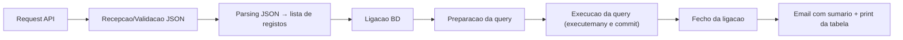

# Pipeline Meteo (WeatherBit → PostgreSQL/CSV) — v0.2.0 (context-aware)

Pipeline para:
1. Recolher observações meteorológicas (por defeito: WeatherBit)
2. Transformar JSON → registos normalizados
3. Persistir em PostgreSQL (online) ou CSV (offline)
4. Enviar email com sumário (tempos por etapa + OK/FAIL)

---

## Indice

- [Visao geral](#visao-geral)
- [Requisitos](#requisitos)
- [Configuracao](#configuracao)
- [Como executar](#como-executar)
- [Modo offline](#modo-offline-sem-base-de-dados)
- [Fluxo da pipeline](#fluxo-da-pipeline)
- [Tabela alvo ipma obs](#tabela-alvo-ipma-obs)
- [Funcoes (API interna)](#funcoes-api-interna)
- [Limitacoes conhecidas (baseline)](#limitacoes-conhecidas-baseline)
- [Proximos passos](#proximos-passos)

---

## Visao geral

O script implementa duas variantes:

- **`pipeline_meteo_normal()`**: faz primeiro o pedido à API e só depois liga à BD.
- **`pipeline_meteo_heavy()`**: liga à BD primeiro e só depois chama a API (útil para comparar comportamento/tempos).

No fim, em ambos os casos:

- imprime a tabela de execução no terminal
- envia um email com o resumo em HTML

---
## Iterações / Progressão

- v0.1 — baseline IPMA → `docs/iterations/v0.1/`
- v0.1.1 — modo offline (CSV) → `docs/iterations/v0.1.1/`
- v0.1.2 — Weatherbit + query → `docs/iterations/v0.1.2/`
- v0.2.0 — context-aware + online/offline automático → `docs/iterations/v0.2.0/`


## Requisitos

- Python 3.10+
- Dependências:
  - `requests`
  - `psycopg2-binary`
  - `tabulate`
  - `python-dotenv`
  - `pandas`


Instalação:

```bash
pip install requests psycopg2-binary tabulate
```

---

## Configuracao (context-aware)

A pipeline lê configuração via variáveis de ambiente (recomendado: `.env` local).

### Pipeline
- `PIPELINE_USER` (default: `gustavo`)
- `PIPELINE_ENV` (default: `local`)
- `PIPELINE_NAME` (default: `GM-IPMA-METEO`)
- `PIPELINE_API_URL_IPMA` (default: IPMA observations)
- `PIPELINE_EMAIL_FROM`
- `PIPELINE_EMAIL_TO` (emails separados por vírgula)
- `PIPELINE_DASHBOARD_URL_METEO` (opcional)

### Base de dados (modo online)
- `DB_MAIN_HOST`
- `DB_MAIN_PORT`
- `DB_MAIN_NAME`
- `DB_MAIN_USER`
- `DB_MAIN_PASSWORD`
- `DB_MAIN_SSLMODE`

> Modo offline: se `DB_MAIN_HOST` estiver vazio (ou começar por "Nao..."), a pipeline não liga à BD e guarda CSV em `offline_output/`.


### Base de dados

A ligação é feita via `DB_CONFIG`.

**Boa prática:** não guardar credenciais no repositório. Em iterações seguintes, mover para **variáveis de ambiente / secrets**.

Exemplo (recomendado):

```bash
export DB_NAME="..."
export DB_USER="..."
export DB_PASSWORD="..."
export DB_HOST="..."
export DB_PORT="26257"
export DB_SSLMODE="require"
```

### Email

O envio usa SMTP em `localhost`:

- `EMAIL_FROM`
- `EMAIL_TO`

Se não tiver SMTP local (ex: Render/Cloud), vai ser preciso:

- SMTP externo (host/porta/auth), ou
- desactivar email no ambiente de dev

---

## Como executar

```bash
python main.py
```

O `__main__` inicia por defeito:

- `pipeline_meteo_normal(API_URL)`

---

## Modo offline (sem base de dados)

Nesta iteração, a pipeline suporta execução offline quando não há acesso à base de dados. Em vez de executar a inserção SQL, os registos resultantes do parsing são guardados num ficheiro CSV para auditoria e validação do pipeline.

---

## Fluxo da pipeline



As métricas por etapa (tempo em segundos) são guardadas num `summary` com o formato:

- `[Etapa, Status, Watch Time (s)]`

---

## Tabela alvo ipma obs

A tabela alvo do logbook chama-se **`ipma_obs`**. Campos principais (resumo):

| Coluna | Tipo |
|---|---|
| `fonte` | varchar(30) |
| `created` | timestamp (DEFAULT CURRENT_TIMESTAMP) |
| `time` | timestamp |
| `idestacao` | varchar(30) |
| `localestacao` | varchar(30) |
| `intensidadeventokm` | real |
| `intensidadevento` | real |
| `descdirvento` | varchar(5) |
| `temperatura` | real |
| `pressao` | real |
| `humidade` | real |
| `precacumulada` | real |
| `iddireccvento` | int |
| `radiacao` | real |
| `latitude` | real |
| `longitude` | real |

### Mapeamento (Weatherbit Current -> parsed_data)

Campos extraídos do Weatherbit (`data[]`) e normalizados em `parsed_data`:

- `fonte` -> `"Weatherbit"`
- `data` -> `ob_time`
- `cidade` -> `city_name`
- `pais` -> `country_code`
- `temp` -> `temp`
- `sensacao_termica` -> `app_temp`
- `humidade` -> `rh`
- `vento` -> `wind_spd`
- `vento_dir` -> `wind_dir`
- `vento_desc` -> `wind_cdir_full`
- `pressao` -> `pres`
- `precipitacao` -> `precip`
- `uv` -> `uv`
- `radiacao_solar` -> `solar_rad`
- `nuvens` -> `clouds`
- `condicao` -> `weather.description`
- `estacao` -> `station`
- `nascer_sol` -> `sunrise`
- `por_sol` -> `sunset`
- `lat` -> `lat`
- `lon` -> `lon`

> Nota: o mapeamento antigo (IPMA / `ipma_obs`) está preservado nos snapshots em `docs/iterations/v0.1/`.


### Query (referência para modo online)

Mesmo em modo offline (CSV), a query fica definida como referência para quando o modo BD voltar.

```sql
INSERT INTO meteo (
  fonte, data, lugar, lat, lon,
  temp, humidade, vento, pressao, precipitacao,
  uv, radiacao_solar, nuvens, condicao,
  vento_dir, vento_desc, sensacao_termica, pais, estacao, nascer_sol, por_sol
)
VALUES (
  %(fonte)s, %(data)s, %(lugar)s, %(lat)s, %(lon)s,
  %(temp)s, %(humidade)s, %(vento)s, %(pressao)s, %(precipitacao)s,
  %(uv)s, %(radiacao_solar)s, %(nuvens)s, %(condicao)s,
  %(vento_dir)s, %(vento_desc)s, %(sensacao_termica)s, %(pais)s, %(estacao)s, %(nascer_sol)s, %(por_sol)s
);

```

---

## Funcoes (API interna)

> Dica: nesta 1ª iteração, documentou-se “o que existe”. Nas iterações seguintes, irá ser atualizada esta secção com as mudanças e o racional.

### `request_data(api_url)`

- **O que faz:** GET ao endpoint REST e devolve JSON + tempo.
- **Retorna:** `(json_dict, elapsed_s)`
- **Erros:** exceptions de rede/HTTP (`raise_for_status`, timeout, etc.)

### `receive_data(json_data)`

- **O que faz:** valida que o JSON não está vazio.
- **Retorna:** `(json_data, elapsed_s)`
- **Erros:** `ValueError` se o JSON for vazio/ inválido.

### `parse_data(json_data)`

- **O que faz:** transforma o JSON do IPMA em lista de registos (um por estação e timestamp).
- **Retorna:** `(parsed_list, elapsed_s)`

### `connect_db()`

- **O que faz:** cria a ligação à BD via `psycopg2`.
- **Retorna:** `(conn, elapsed_s)`

### `prepare_query(parsed_data)`

- **O que faz:** define a SQL de inserção (parametrizada).
- **Retorna:** `(query_str, elapsed_s)`
- **Nota:** o parâmetro `parsed_data` não é usado nesta versão.

### `execute_query(conn, query, parsed_data)`

- **O que faz:** `executemany(query, parsed_data)` + `commit()`.
- **Retorna:** `elapsed_s`

### `close_connection(conn)`

- **O que faz:** fecha a ligação à BD.
- **Retorna:** `elapsed_s`

### `send_summary_email(summary_rows)`

- **O que faz:** constrói uma tabela HTML (`tabulate`) e envia email via SMTP.
- **Notas:** requer SMTP em `localhost` (ajustar em ambiente cloud).

### `pipeline_meteo_normal(api_url)`

- **O que faz:** executa o fluxo completo e constrói o `summary`.
- **Em erro:** adiciona `["Erro", "FAIL (...)", 0]`.
- **Finalmente:** envia email e imprime a tabela.

### `pipeline_meteo_heavy(api_url)`

- **O que faz:** igual à normal, mas liga à BD primeiro.
- **Em erro:** tenta fechar a ligação se já existir.
- **Finalmente:** envia email e imprime a tabela.

---

## Limitacoes conhecidas (baseline)

- **Desalinhamento parsing ↔ SQL / tabela alvo**
  - O parsing está mais próximo de `ipma_obs`, mas a query actual aponta para `meteo` e usa campos que não existem no parsed (ex: `lugar`, `lat`, `lon`).
- **Credenciais no código**
  - Devem passar para env vars/secrets para permitir portabilidade e partilha segura.
- **Sem idempotencia / deduplicacao**
  - Se correr várias vezes, podes inserir duplicados (futuro: `ON CONFLICT`, chaves naturais, etc.).
- **Dependencia de SMTP local**
  - Em cloud, `localhost` pode não ter SMTP.

---

## Proximos passos

1. Alinhar `parse_data()` + `prepare_query()` com a tabela `ipma_obs`
2. Enriquecimento: obter `localestacao/lat/lon` via metadados das estações
3. Migrar configuração para `env vars`/secrets e retirar credenciais do código
4. Implementar deduplicação / idempotência (ex: `ON CONFLICT`)
5. Melhorar logging e rastreabilidade (endpoint, destino, contexto de execução)
