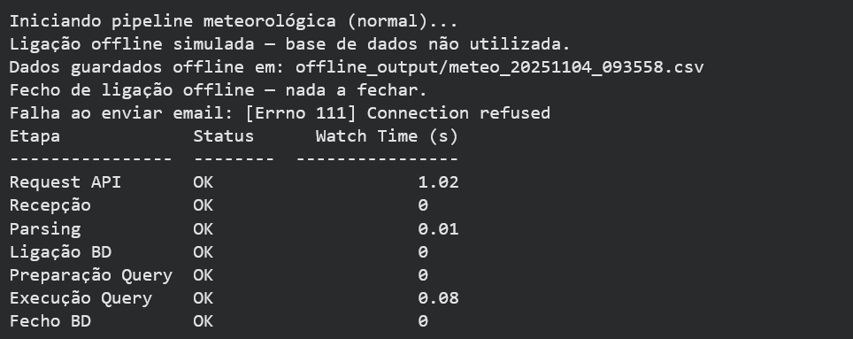

# Evidências — v0.3

## Output de execução (terminal)


### Exemplo de output
```text


Iniciando pipeline meteorológica (normal)...
Ligação offline simulada — base de dados não utilizada.
Dados guardados offline em: offline_output/meteo_20251104_093558.csv
Fecho de ligação offline — nada a fechar.
Falha ao enviar email: [Errno 111] Connection refused
Etapa             Status      Watch Time (s)
----------------  --------  ----------------
Request API       OK                    1.02
Recepção          OK                    0
Parsing           OK                    0.01
Ligação BD        OK                    0
Preparação Query  OK                    0
Execução Query    OK                    0.08
Fecho BD          OK                    0

